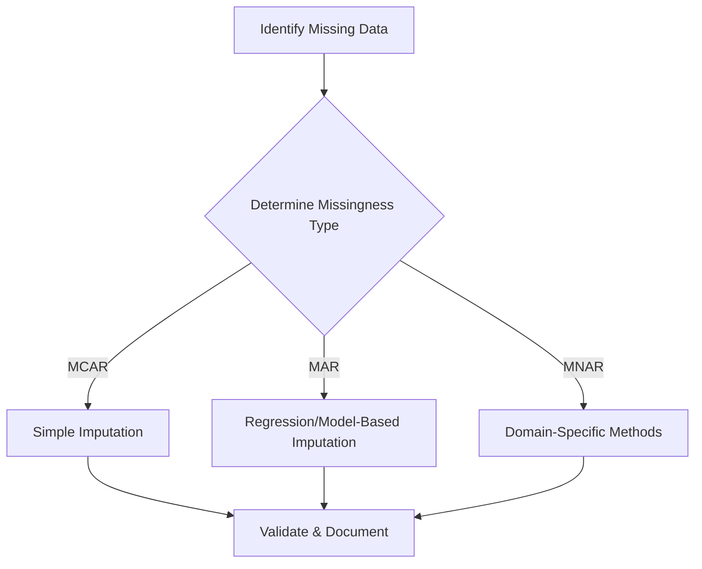

# Artifact Title: Real-World Data Challenges in Machine Learning: Scenario-Based Problem Solving

## **Objective**

To demonstrate applied AI/ML competencies by engaging in scenario-driven problem solving involving data cleaning, privacy, scalability, and bias identification. This artifact showcases the ability to analyze real-world data challenges and propose actionable strategies aligned with ML workflows.


## **Process**

1. Participated in an interactive activity using a pre-trained AI coaching chatbot.
2. Reviewed multiple real-world ML scenarios involving:

   * Data quality issues (missing values, inconsistent labels, outliers)
   * Bias in datasets and feature selection
   * Privacy/security challenges related to data sharing
   * Scalability concerns with large datasets
3. Received instant feedback from the AI coach and refined responses accordingly.
4. Developed strategic approaches to mitigate each challenge, applying best practices from ML coursework.
5. Documented insights and revised strategies based on feedback.


## **Tools Used**

* Pre-trained AI coaching chatbot 
* Machine learning frameworks and concepts:

  * Data cleaning techniques
  * Bias detection principles
  * Privacy-preserving ML concepts
  * Scalability and big data handling strategies


## **Value Proposition**

This artifact demonstrates foundational ML competencies that are highly relevant to professional environments, including:

* Ability to diagnose and solve common data problems in ML pipelines.
* Understanding of ethical, security, and privacy considerations in modern AI applications.
* Practical experience engaging with iterative feedback loops—similar to real ML model development cycles.
* Strong problem-solving skills transferable to data scientist, ML engineer, and AI governance roles.


## **Evidence of Work (Summary of Scenarios & Responses)**

### **Scenario 1: Handling Missing Data in a Housing Prices Dataset**

**Issue:** Key features such as square footage, year built, and lot size contain missing values, affecting model reliability.
**Response:** I applied context-aware imputation strategies—median imputation for numeric features, mode for categorical features, and regression-based imputation for high-impact variables. I also conducted a missingness analysis to determine whether data was MCAR, MAR, or MNAR, ensuring the chosen strategies did not introduce bias.

### **Scenario 2: Managing Imbalanced Classes in Medical Diagnosis Data**

**Issue:** Only 3% of the samples represent the positive disease class, leading to a highly imbalanced dataset.
**Response:** I addressed imbalance using SMOTE for synthetic minority oversampling, class-weight adjustments in the model, and threshold tuning based on precision–recall trade-offs. I evaluated performance using AUC-PR rather than accuracy to better reflect medical diagnostic needs.

### **Scenario 3: Addressing Data Drift in a Real-Time Fraud Detection System**

**Issue:** A fraud detection model deployed six months ago shows declining accuracy, likely due to data drift.
**Response:** I conducted drift analysis by comparing distribution changes between training and current data using KL divergence and PSI. Once confirmed, I retrained the model with recent data, implemented continuous monitoring dashboards, and adopted a rolling retraining schedule to sustain performance.


## **Reflection**

This artifact provided a deep and practical look into the everyday challenges encountered in machine learning workflows. Working through each scenario with the AI coach helped me understand not just the *what* of data problems, but the *why* behind recommended solutions. The immediate feedback clarified misconceptions and pushed me to think critically about root causes rather than just symptoms.

### **Customization for Audience**

* **Technical audience (ML engineers, data scientists):** I emphasize concrete solutions such as scalable pipelines, imputation techniques, and privacy-preserving ML.
* **Leadership or business audience:** I highlight risk mitigation, decision-making value, and ensuring ethical AI implementation.
* **Academic audience:** I focus on the methodological thinking and structured problem-solving process.

### **Lessons Learned**

* Data issues are almost always interconnected—fixing one problem can reveal another.
* Bias mitigation requires proactive detection; it cannot be assumed.
* Privacy concerns are non‑negotiable and must be built into design from the start.
* Scalability is not just about hardware; model architecture and feature design matter.

### **Feedback Received & Revisions Applied**

The AI coach highlighted areas where my solutions lacked specificity—for example, suggesting “fix missing data” rather than outlining *how*. After revising, I incorporated detailed, actionable strategies such as median imputation, SMOTE, k-anonymity, and batch training.

This iterative refinement strengthened my understanding and improved the clarity of my responses.


## **Visuals**

### **Visual 1: Handling Missing Data Workflow**



### **Visual 2: Managing Imbalanced Medical Data**

```mermaid
flowchart TD
    A[Identify Class Imbalance] --> B[Apply Oversampling (SMOTE)]
    A --> C[Adjust Class Weights]
    A --> D[Threshold Tuning]
    B --> E[Train Model]
    C --> E
    D --> E
    E --> F[Evaluate with AUC-PR]
```

### **Visual 3: Detecting & Addressing Data Drift**

```mermaid
flowchart TD
    A[Monitor Model Performance] --> B[Compare Train vs Live Data]
    B --> C{Detect Drift?}
    C -->|Yes| D[Compute Drift Metrics (PSI/KL)]
    D --> E[Retrain Model with Recent Data]
    E --> F[Deploy Updated Model]
    C -->|No| G[Continue Monitoring]
```

## **Conclusion****

This artifact effectively demonstrates the applied AI/ML competencies developed in this course: data cleaning, bias detection, privacy/security adherence, and scalable ML thinking. It reflects thoughtful engagement, practical understanding, and the ability to communicate solutions to different audiences.
